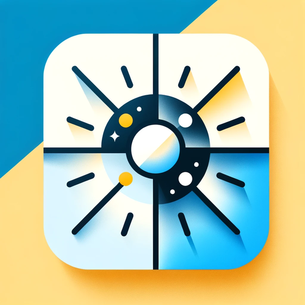

<!-- Improved compatibility of back to top link: See: https://github.com/othneildrew/Best-README-Template/pull/73 -->
<a name="readme-top"></a>
<!--
*** Thanks for checking out the Best-README-Template. If you have a suggestion
*** that would make this better, please fork the repo and create a pull request
*** or simply open an issue with the tag "enhancement".
*** Don't forget to give the project a star!
*** Thanks again! Now go create something AMAZING! :D
-->


<!-- PROJECT SHIELDS -->
<!--
*** I'm using markdown "reference style" links for readability.
*** Reference links are enclosed in brackets [ ] instead of parentheses ( ).
*** See the bottom of this document for the declaration of the reference variables
*** for contributors-url, forks-url, etc. This is an optional, concise syntax you may use.
*** https://www.markdownguide.org/basic-syntax/#reference-style-links
-->
[![Contributors][contributors-shield]][contributors-url]
[![Forks][forks-shield]][forks-url]
[![Stargazers][stars-shield]][stars-url]
[![Issues][issues-shield]][issues-url]
[![LinkedIn][linkedin-shield]][linkedin-url]


<!-- PROJECT LOGO -->
<br />
<div align="center">
  <a href="https://github.com/othneildrew/Best-README-Template">
    
  </a>

  <h3 align="center">Light Alarm</h3>

  <p align="center">
  Wake-up with light naturally!
    <br />
    <a href="https://github.com/vladr7/SunAlarm"><strong>Explore the docs »</strong></a>
    <br />
    <br />
    ·
    <a href="https://github.com/vladr7/SunAlarm/issues">Report Bug</a>
    ·
    <a href="https://github.com/vladr7/SunAlarm/issues">Request Feature</a>
  </p>
</div>


<!-- TABLE OF CONTENTS -->
<details>
  <summary>Table of Contents</summary>
  <ol>
    <li>
      <a href="#about-the-project">About The Project</a>
      <ul>
        <li><a href="#built-with">Built With</a></li>
      </ul>
    </li>
    <li>
      <a href="#getting-started">Getting Started</a>
      <ul>
        <li><a href="#prerequisites">Prerequisites</a></li>
        <li><a href="#installation">Installation</a></li>
      </ul>
    </li>
    <li><a href="#usage">Usage</a></li>
    <li><a href="#contributing">Contributing</a></li>
    <li><a href="#license">License</a></li>
    <li><a href="#contact">Contact</a></li>
    <li><a href="#contact">Published</a></li>
    <li><a href="#acknowledgments">Acknowledgments</a></li>
  </ol>
</details>


<!-- ABOUT THE PROJECT -->
## About The Project

I wanted to replicate an existing Light Alarm app that had bad UI and I wanted to have the same but with better UI, so that's why I built it, on top of the intention to learn more about Android specifics but even more about Compose. 
Also I've learned a lot about handling background tasks required for Alarm Clock.

### Built With

* [Android Studio](https://developer.android.com/studio)
* [Firebase](https://firebase.google.com/)
* [Kotlin](https://kotlinlang.org/)
* [Compose](https://developer.android.com/jetpack/compose)
* [Coroutines](https://developer.android.com/studio](https://kotlinlang.org/docs/coroutines-overview.html))
* [Flows](https://developer.android.com/kotlin/flow)
* [DataStore](https://developer.android.com/topic/libraries/architecture/datastore)
* [HILT](https://dagger.dev/hilt/)
* [SunRise API]([https://dagger.dev/hilt/](https://sunrisesunset.io/api/))
* [AlarmManager]([https://dagger.dev/hilt/](https://developer.android.com/reference/android/app/AlarmManager))


<p align="right">(<a href="#readme-top">back to top</a>)</p>


<!-- GETTING STARTED -->
## Getting Started

To get a local copy up and running follow these simple example steps.

### Prerequisites

* Android studio

You can download it here: https://developer.android.com/studio

### Installation

You just Clone the repo 
   ```sh
   git clone https://github.com/vladr7/SunAlarm.git
   ```

And then import it to Android Studio

<!-- USAGE EXAMPLES -->
## Usage

Here i will post some screenshots to ilustrate how the app works.

1. Add new Alarm

 

2. Set when to light up
 
 

 

 

3. Configure light color if you like

 

4. Settings

  

5. Light up screen

 


<!-- CONTRIBUTING -->
## Contributing

Contributions are what make the open source community such an amazing place to learn, inspire, and create. Any contributions you make are **greatly appreciated**.

If you have a suggestion that would make this better, please fork the repo and create a pull request. You can also simply open an issue with the tag "enhancement".
Don't forget to give the project a star! Thanks again!

1. Fork the Project
2. Create your Feature Branch (`git checkout -b feature/AmazingFeature`)
3. Commit your Changes (`git commit -m 'Add some AmazingFeature'`)
4. Push to the Branch (`git push origin feature/AmazingFeature`)
5. Open a Pull Request

<p align="right">(<a href="#readme-top">back to top</a>)</p>


<!-- LICENSE -->
## License

Distributed under the Apache-2.0 License. See `LICENSE.txt` for more information.

<p align="right">(<a href="#readme-top">back to top</a>)</p>


<!-- CONTACT -->
## Contact

Email: ricean.vlad7@gmail.com

Linkedin: [Profile](https://www.linkedin.com/in/vlad-ricean-12155622a/)

Project Link: [Link](https://github.com/vladr7/SunAlarm)

<p align="right">(<a href="#readme-top">back to top</a>)</p>

## Published

App is published on play store: [Playstore](https://play.google.com/store/apps/details?id=com.riviem.SunAlarm&hl=en)

<!-- ACKNOWLEDGMENTS -->
## Acknowledgments

* [Lottie animations](https://lottiefiles.com/)
* [Android Icons](https://icons8.com/icons/set/android)
* [Lexica Images AI](https://lexica.art/aperture)

<p align="right">(<a href="#readme-top">back to top</a>)</p>


<!-- MARKDOWN LINKS & IMAGES -->
<!-- https://www.markdownguide.org/basic-syntax/#reference-style-links -->
[contributors-shield]: https://img.shields.io/github/contributors/vladr7/SunAlarm.svg?style=for-the-badge
[contributors-url]: https://github.com/vladr7/SunAlarm/graphs/contributors
[forks-shield]: https://img.shields.io/github/forks/vladr7/SunAlarm.svg?style=for-the-badge
[forks-url]: https://github.com/vladr7/SunAlarm/network/members
[stars-shield]: https://img.shields.io/github/stars/vladr7/SunAlarm.svg?style=for-the-badge
[stars-url]: https://github.com/vladr7/SunAlarm/stargazers
[issues-shield]: https://img.shields.io/github/issues/vladr7/SunAlarm.svg?style=for-the-badge
[issues-url]: https://github.com/vladr7/SunAlarm/issues
[linkedin-shield]: https://img.shields.io/badge/-LinkedIn-black.svg?style=for-the-badge&logo=linkedin&colorB=555
[linkedin-url]: https://www.linkedin.com/in/vlad-ricean-12155622a

